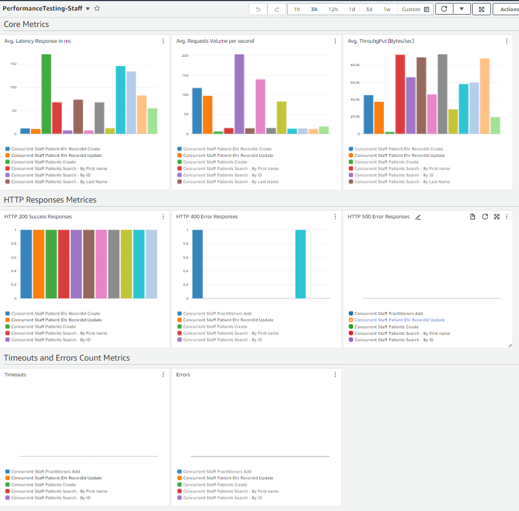

# Displaying Performance Testing Statistical data to AWS CloudWatch Metrics

## Contents
1. [Overview](#overview)
2. [Setup](#setup)
3. [Sample Metrics](#sample-metrics)


## Overview

Transformation of Performance Testing Statistical data into AWS Customized CloudWatch Metrics to make it easier in assimilating testing results in the form interactive charts/graphs and having the provision to observe slow-down queries.

Autocannon based Performance Results are transferred to CloudMetrics which are then transformed into various metrics. 

In total, **8 type of Metrices** are supported.

- Avg. Latency Response in ms

- Avg. Requests Volume per second

- Avg. ThrouhgPut [Bytes/sec]

- HTTP 200 Success Responses

- HTTP 400 Error Responses

- HTTP 500 Error Responses

- Timeouts

- Errors


## Setup

From the terminal, run following commands:

```
$ cd perfTestingMetrics
$ chmod -R 777 *.sh
$ ./metricsSetup.sh [–f] <env>

Arguments:
1. env - The environment on AWS where the infrastructure will be created
        Possible Values: externalQA (For QA Development Testing on AWS)
                        uat (For Beta Environment on AWS)
                        beta (For Beta Environment on AWS)
                        staging (For Staging Environment on AWS)
                        prod (For Production Environment on AWS)
                        dev (For Local Development Testing on AWS)

Options:
 -f - Create all resources again 'forcefully' by removing previous one if found existed

```


## Sample Metrics

Following shot has been taken from CloudWatch Dashboard:


